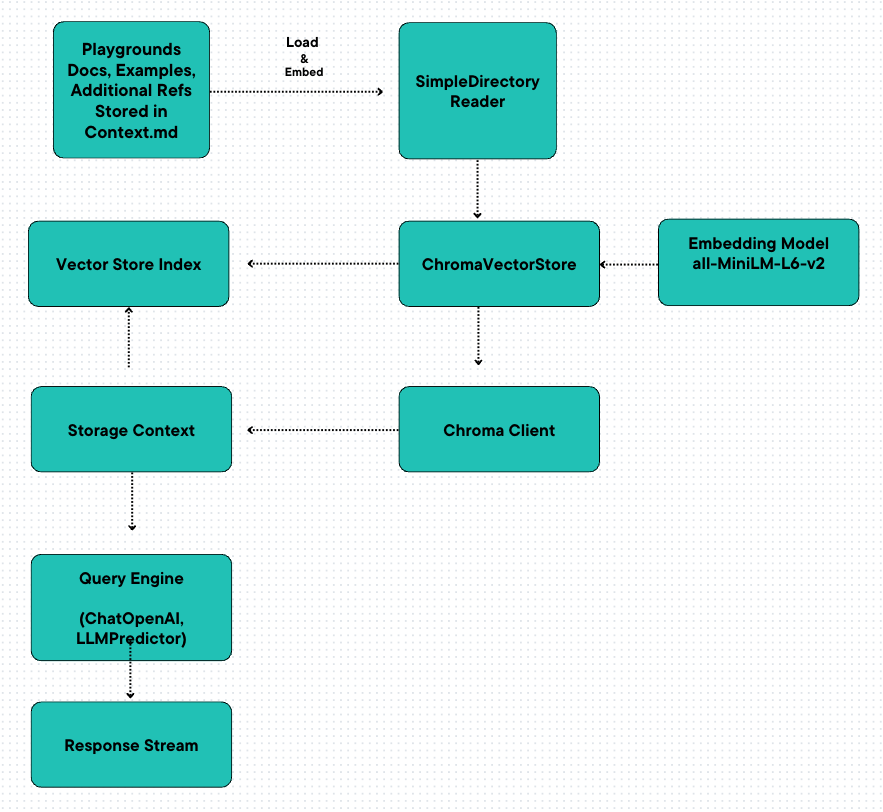

# pgGPT_v1: Intelligent Search and Learning System for Subgrounds 


pgGPT_v1 is an intelligent search system developed to offer a sophisticated way to interact with Subgrounds documentation and Jupyter Notebook examples (`.ipynb` documents). Leveraging the power of OpenAI's language model, HuggingFace's transformer models, and ChromaDB, pgGPT_v1 is designed to handle large volumes of data with higher efficiency.

## System Architecture

Below is a high-level diagram showcasing the overall system architecture:



## Core Components

1. **ChatOpenAI**: Utilizes OpenAI's GPT model for conversational AI, facilitating the processing of user queries in natural language.
2. **HuggingFaceEmbeddings**: Employs transformer models from HuggingFace to generate embeddings for documents.
3. **ChromaDB**: Manages the vector space index used for querying the documents. Supports creating and managing collections of documents, storing the embeddings, and persisting the data.
4. **LangchainEmbedding**: Converts the documents into a vector space representation using HuggingFaceEmbeddings, enabling effective semantic searches.
5. **VectorStoreIndex**: Creates an index from the documents or from an existing vector store. The index is then used for searching and querying the documents.
6. **LLMPredictor**: Utilizes the language model to make predictions.
7. **ServiceContext**: Holds the AI language model and the language model predictor.

## How It Works

The system uses a predefined teaching prompt to shape the AI's responses to a wide variety of questions, creating context-aware responses. It strictly adheres to the information, structures, and syntax present in the provided documents.

The system also provides a reference to the part of the documentation from which the information or code has been derived, thus enabling users to refer back to the original documents for further learning.

## Example Query

To make a query, you'd ask the system something like:

```python
response = query_engine.query("Teach me about subgrounds, the various ways to query with subgrounds and how to use synthetic fields. Give me code examples as well.")
response.print_response_stream()
```

# Development

If you want to build or work on the code, follow the instructions below:

## Prerequisites
- Python 3.7+
- An OpenAI API key. You can obtain this key from the [OpenAI website](https://beta.openai.com/signup/) by creating an account and a new application.

## Setup

1. Clone the repository.

`git clone https://github.com/YourRepo/pgGPT_v1.git`

2. Navigate into the directory.

`cd pgGPT_v1`

3. Install the required packages.

`pip install -r requirements.txt`

4. Set your OpenAI API key as an environment variable. Replace Your_OpenAI_API_Key with your actual key.

`export OPENAI_API_KEY='Your_OpenAI_API_Key'`

After setting up, you can modify the code according to your needs.

Please note that you must respect the OpenAI use case policy while using their API for any development or testing.
