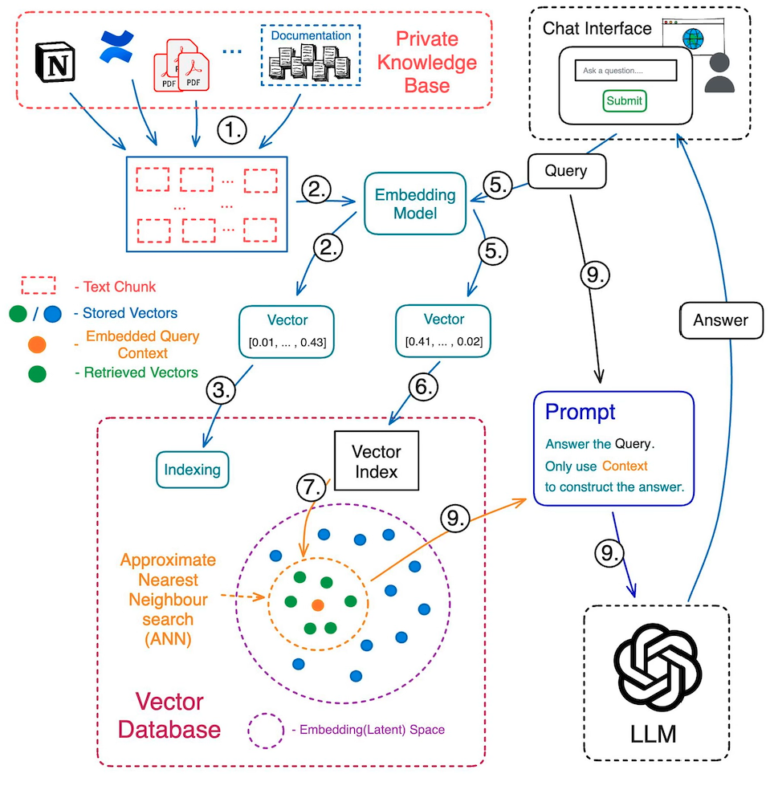

# pgGPT_Discord Bot

The pgGPT Discord Bot is an LLM-driven system designed for Discord servers. With a primary focus on leveraging the capabilities of the Subgrounds, this bot aims to provide a seamless interface for querying and downloading decentralized subgraph data directly within Discord. 

Further enhancing its capabilities is the integration of a sophisticated AI language model, enabling intelligent interactions and in-depth assistance for `Subgrounds`. The integration of the Playgrounds Docs with an LLM provides a dynamic conversational system with augmented understanding of the Playgrounds ecosystem.

---

## 📌 Table of Contents:
- [pgGPT\_Discord Bot](#pggpt_discord-bot)
  - [📌 Table of Contents:](#-table-of-contents)
  - [1. 🏗 System Architecture:](#1--system-architecture)
    - [Key Components:](#key-components)
  - [2. 🚀 Features \& Workflows:](#2--features--workflows)
    - [AI Conversations:](#ai-conversations)
    - [Subgraph Query Workflow:](#subgraph-query-workflow)
  - [3. 📜 Codebase Overview:](#3--codebase-overview)
  - [4. 🔧 Setup \& Installation:](#4--setup--installation)
  - [5. 📦 Docker Deployment:](#5--docker-deployment)
    - [Prerequisites:](#prerequisites)
    - [Instructions:](#instructions)
      - [Building the Docker Image:](#building-the-docker-image)
      - [Running the Docker Container:](#running-the-docker-container)
      - [Viewing Container Logs:](#viewing-container-logs)
      - [Copying Files from the Container:](#copying-files-from-the-container)
      - [Updating after Code Changes:](#updating-after-code-changes)
  - [6. 🤖 AI \& LLM System Overview:](#6--ai--llm-system-overview)
    - [Loading and Splitting Data:](#loading-and-splitting-data)
    - [Storing and Retrieving Data:](#storing-and-retrieving-data)
    - [Generating Responses:](#generating-responses)
    - [Customizing LLM Interactions:](#customizing-llm-interactions)
  - [7. 💡 Usage \& Commands:](#7--usage--commands)
  - [8. 🤝 Contributing:](#8--contributing)
  - [9. 📄 License \& Contact:](#9--license--contact)

---

## 1. 🏗 System Architecture:



```plaintext
+------------------------+
|    Discord Server      |
|                        |
|  +------------------+  |
|  |    pgGPT Bot     |<--------- GraphQL Queries ----------> [Playgrounds GraphQL API]
|  +------------------+  |
|           |             |
|           | API Key     |
|           |             |
+-----------v-------------+
            |
            v
+------------------------+
| User's DM Channel      |
+------------------------+

```

### Key Components:
- **Discord Server**: The primary environment where the bot operates.
- **pgGPT Bot**: Our main bot module, responsible for processing commands and interactions.
- **Playgrounds GraphQL API**: External GraphQL API for querying decentralized subgraphs.
- **User's DM Channel**: Private channel for sensitive interactions like API key collection.

## 2. 🚀 Features & Workflows:

### AI Conversations:
1. **Command Initiation**: Users trigger the AI by using the `/ask_ai` command.
2. **AI Backend Processing**: Utilizing a combination of retrieval and generative methods, the bot fetches or constructs responses based on the provided `Subgrounds` document.
3. **Response Delivery**: The AI's response is presented to the user in a structured embed format.

### Subgraph Query Workflow:
1. **Command Start**: Users initiate with the `/query_subgraph` command.
2. **API Key Collection**: A DM is sent to the user to gather their Playgrounds API key securely.
3. **Entity Listing**: Post key retrieval, the bot fetches and displays available entities from the specified subgraph.
4. **Entity Querying**: Users select an entity. The bot performs the query and generates the results.
5. **Result Presentation**: Query results are presented to users in a downloadable CSV format.

## 3. 📜 Codebase Overview:
- **main.py**: Entry point of the bot. Handles command registration, Discord events, and utility functions.
- **pgGPT.py**: Contains the AI's backend logic, integrating OpenAI language models and the retrieval mechanism.
- **graphql_handler.py**: Responsible for GraphQL interactions, schema introspections, and query executions.

## 4. 🔧 Setup & Installation:
1. **Repository Setup**: Clone the repository.
2. **Environment Prep**: Activate a Python virtual environment.
3. **Dependency Management**: Use `pip install -r requirements.txt`.
4. **Environment Variables**: Configure necessary environment variables (e.g., bot token, OpenAI API key).
5. **Starting the Bot**: Execute `python main.py`.

## 5. 📦 Docker Deployment:

### Prerequisites:
- Ensure Docker is installed. If not, get it from [Docker's official website](https://www.docker.com/).

### Instructions:

#### Building the Docker Image:
- Navigate to the project root (where the Dockerfile is) and run:
`docker build -t pggpt_bot_image .`

- Replace `pggpt_bot_image` if you wish to use a different image name.

#### Running the Docker Container:
- With the image built, you can now run the bot in a container:
`docker run -e DISCORD_BOT_TOKEN=your_discord_bot_token -e BOT_TOKEN=your_bot_token -e DISCORD_CLIENT_ID=your_discord_client_id -e ALLOWED_SERVER_IDS=your_allowed_server_ids -e SERVER_TO_MODERATION_CHANNEL=your_server_to_moderation_channel -e OPENAI_API_KEY=your_openai_api_key pggpt_bot_image`

Remember to replace placeholders with your actual values.


#### Viewing Container Logs:

- If the application in the Docker container writes logs to stdout or stderr, view these logs using:
`docker logs container_name_or_id`


#### Copying Files from the Container:

- To copy files (e.g., logs) from your container to your host:
`docker cp container_name_or_id:/path/in/container /path/on/host`


#### Updating after Code Changes:

- If you update your bot's code and wish to reflect those in Docker:

  - Rebuild the Docker image as shown above.
  - Run the container using the new image.

Notes:

When running Docker locally, it uses system resources. Shutting down the machine stops the containers. For continuous service, deploy Docker containers on a cloud provider.

## 6. 🤖 AI & LLM System Overview:

The pgGPT Discord Bot leverages Large Language Models (LLMs) to provide a deep and interactive AI experience for users. The AI backend, designed around OpenAI's LLMs, can process and generate responses based on structured and unstructured data sources. This section delves into the AI system's architecture and how it integrates with the bot.

### Loading and Splitting Data:

- **Document Loading**: The bot uses loaders to ingest unstructured data, like markdown documents, into the system. This data is stored as LangChain Documents.
- **Text Splitting**: Once loaded, documents are split into manageable chunks. This allows for more efficient embedding and storage.

### Storing and Retrieving Data:

- **Vector Storage**: Chunks are embedded into vectors and stored in vector stores. The bot uses FAISS for efficient vector storage and retrieval.
- **Retrieval**: When a question is posed, relevant chunks are retrieved from the vector store using similarity search. This ensures that the AI has contextually appropriate data to generate responses.

### Generating Responses:

- **Answer Generation**: With relevant chunks retrieved, an LLM produces answers. The bot uses a ChatOpenAI model for this, which integrates the LLM and the retrieval mechanism.

### Customizing LLM Interactions:

- **Custom Prompts**: The bot uses a custom prompt template to guide the LLM's interactions, ensuring responses are consistent and contextually aware.
- **Source Citations**: The bot can also return the source documents used to generate an answer, providing users with the context and origin of the information.

For a deeper dive into the LLM system's architecture and capabilities, refer to the provided API and library documentation.

## 7. 💡 Usage & Commands:

- **Bot Onboarding**: Invite the bot to your Discord server.
- **Hello Command**: Begin a conversation using `/hello`.
- **Subgraph Queries**: Use `/query_subgraph` to start a query process.
- **AI Interactions**: Engage with the AI via `/ask_ai` followed by a question.
- **Help**: Unsure about commands? Just type `/help`.

## 8. 🤝 Contributing:

Developers are encouraged to contribute. Start by forking the repository and then submit your pull requests. Ensure that you follow code style guidelines and provide adequate documentation.

## 9. 📄 License & Contact:

- **License**: MIT license.
- **Contact**: For questions or technical issues, open an issue on our GitHub repository.


